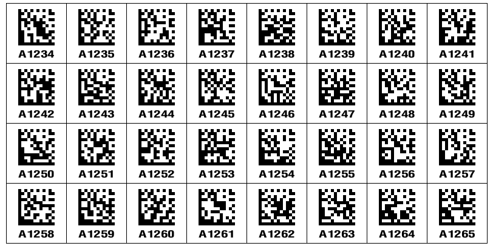

# Zebra ZPL builder

A helper library for generating ZPL labels programmatically in Zig.

Note: Not all ZPL commands/features are currently supported.

### Usage

```bash
zig fetch --save git+https://github.com/bcrist/zpl
```

### Example

[make_labels.zig](src/make_labels.zig) is an example program which can either send commands directly to a connected printer (Windows-only for now) or dump the ZPL commands to stdout.  It generates 4" x 2" labels containing 32 data-matrix barcodes containing serial numbers with a configurable prefix:
